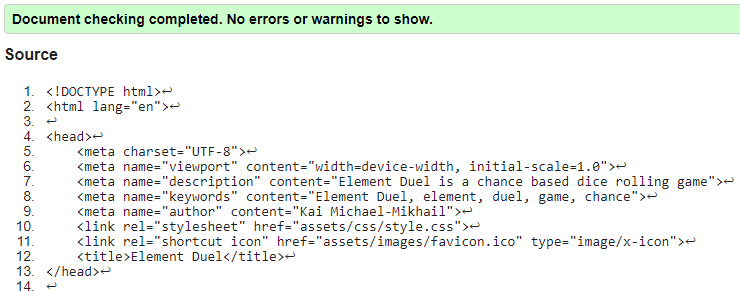
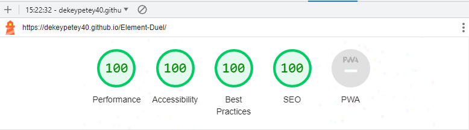
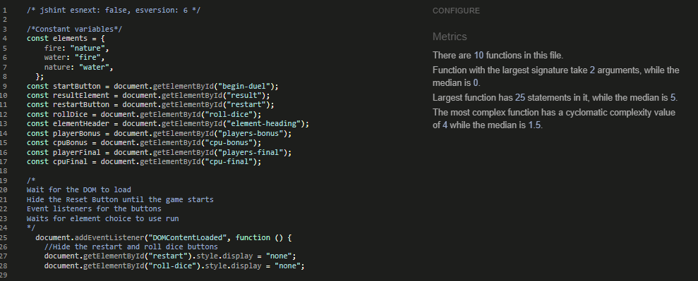

# _Element Duel_

[Am I Responsive link]()

---
# Introduction

[Element Duel](https://dekeypetey40.github.io/Element-Duel/) is a website where one can play Element Duel.

This website runs a game called Element Duel created by myself, Kai Michael-Mikhail. It is inspired, in part, by the Pokemon franchise and how certain types are supereffective against others, and, in part, by tabletop roleplaying games that use a twenty-sided dice to determine outcomes. 

The website provides an interactive experience where the user can play against the computer as much or as little as they wish. This was made as my second project as part of Code Institue's Full Stack Developer course.

## Technologies used
- [HTML](https://en.wikipedia.org/wiki/HTML)
- [CSS](https://en.wikipedia.org/wiki/CSS)
- [Javascript](https://en.wikipedia.org/wiki/JavaScript)
- [Font Awesome](https://fontawesome.com/)
- [Google Fonts](https://fonts.google.com/)
- [VScode](https://code.visualstudio.com/) was the editor used to write my code.
- [Balsamic](https://balsamiq.com/) was used to make wireframes in the design process.

---

## User stories
- As a first time visitor, I want to easily understand how the game works, so that I become interested in it.
- As a first time visitor, I want the website to be easy to interact with, so I can easily have fun playing the game.
- As a user, I want to be able to see who made the website and see their GitHub repository, so that I can see what they can do.
- As a mobile device user, I want to interact with a responsive website, so that I can visit it with any device.

---

# Design 

## Wireframes

Wireframes were used in the beggining stages of the design phase. 
[Link to wireframe images](https://github.com/Dekeypetey40/Happy-Dog-Website/tree/main/wireframes) 

# Features

## Home page

- ### Navigation

---

- ### Hero section
  

   <!-- FIX THIS -->
---

- ### Ethos section
 

- ### Footer
  

---

# Future Features
  - A services offered page with listed prices for each service.
  - A meet the trainers/dog walker page.

# Testing
  - I tested to make sure the website works in the following browsers: Firefox, Chrome and Edge. 
  - I used Chrome's devtools and [Am I Responsive](https://ui.dev/amiresponsive) to check that the stylings respond and everything functions on all screen sizes. 
  - I tested every button and link to confirm that they work and lead where they are supposed to. 

## Validator testing
* [HTML Validator](https://validator.w3.org/) was run. No errors or warnings were shown. 
 

* [CSS Validator](https://validator.w3.org/) was run and no errors were found, but some minor warnings were attended to. At the time of submission the css code successfully passed the validator with no errors and only minor warnings. 

* Lighthouse in Chrome Developer Tools was used. Initially, there was a low accessibility rating. The cause of this was a lack of aria-labels on the buttons and some html semantic structure. After this was fixed there were no issues.
- Element Duel main page 
* [JSHint](https://jshint.com/) was run to check my javascript code. It detected two functions called twice and some missing semicolons. After this no errors were found. 

## Bugs

## Solved bugs
  - My compare elements function did not work as it should and was not adding 5 to the player who had an advantageous element. This was largely due to the fact that I had called two functions multiple times. Once this was fixed the game worked as it should. 
  - When I reformatted my HTML file to be easier to read and then tried to adapt my js file to it the game ceased to function as it should. I undid all my changes and redid the process, checking everything was working with each change I made. This process resulted with the desired effect. 

  ***
## Unsolved bugs

## Manual Testing

| feature | action | expected result | tested | passed | comments |
| --- | --- | --- | --- | --- | --- |
| Element choice Area | | | | | |
| Element Header | Click the Begin Duel button | InnerText changes from "your fate is yet to be decided" to "choose your element" | Yes | Yes |  |
| Element Header | Click the Roll Dice button | InnerText changes from "choose your element" to one of two options "x element is super effective against y element" or "equal elements" | Yes | Yes |  |
| Fire element button | Click the button | fire becomes the players chosen element, cpuChoice is run and the roll dice button appears | Yes | Yes | If user doesn't choose an element the roll dice button does not appear. |
| Water element button | Click the button | water becomes the players chosen element, cpuChoice is run and and the roll dice button appears | Yes | Yes | If user doesn't choose an element the roll dice button does not appear. |
| Nature element button | Click the button | nature becomes the players chosen element, cpuChoice is run and and the roll dice button appears | Yes | Yes | If user doesn't choose an element the roll dice button does not appear. |
| Results area | | | | | |
| Player Side | | | | | |
| Your element | Click on an element button  | Your chosen element appears beside "Your element:"  | yes | yes | |
| You rolled | Click on the roll dice button  | Your random number before bonuses appears beside "You rolled:" | yes | yes | |
| Your bonus | Click on the roll dice button  | A "+5" or "0" appears beside "Your bonus:" depending on if you picked an advantageous element or not | yes | yes | |
| Your final score | Click on the roll dice button  | Your final score after bonuses appears beside "Your final score:" | yes | yes | |
| Opponent Side | | | | |All of these were tested in the same way and have the same expected results except for Opponent Element |
| Opponent Element | Click on an element button and then roll dice  | First cpuChoice is run and a "?" appears beside Opponent element: and then the opponenets element is revealed | yes | yes | |
| Other button area | | | | | |
| Begin Duel | Click the button | You are prompted to choose an element, the button disappears and the reset button appears | Yes | Yes | If you do not click this button you may not select an element  |
| Reset | Click the button | The page reloads | Yes | Yes |  |
| Roll Dice | Click the button | The results of the game are determined and appear in the correct places. | Yes | Yes |  |
| Score Area | | | | | |
| Wins| Test the game until the player wins | 1 is added to the player's wins tally | Yes | Yes | |
| Losses| Test the game until the computer wins | 1 is added to the player's losses tally | Yes | Yes | |

---

# Deployment
The site was deployed to GitHub pages. The following steps were taken to do so:
1. Log in to [Github](https://github.com/)
2. Navigate to [dekeypetey40/Happy-Dog-Website](https://github.com/Dekeypetey40/Happy-Dog-Website) in the list of repositories
3. In the GitHub repository, navigate to the [Settings](https://github.com/Dekeypetey40/Happy-Dog-Website/settings) tab
4. In Settings select [Pages](https://github.com/Dekeypetey40/Happy-Dog-Website/settings/pages) on the left hand menu.
5. From the source section drop-down menu, select the main branch.
6. Once the main branch has been selected, click on the save button in the branch section. Wait for the link to be generated and then refresh the page.

---
# Credits

## Content

## Media
  - Icon for my website was taken from [Flaticon](https://www.flaticon.com/)
